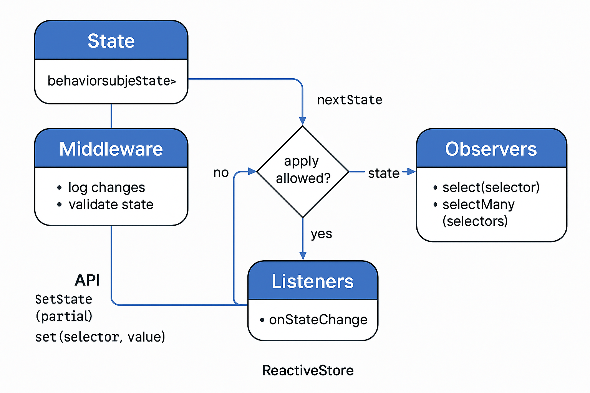

# Rxtor

`Rxtor` es una pequeña librería de gestión de estado reactiva usando RxJS. Ideal para apps React o React Native.

## Instalación

```bash
npm install rxjs
```

## Uso básico

```ts
type State = {
  count: number;
  user: { name: string };
};

const store = new Rxtor<State>({
  count: 0,
  user: { name: 'Alice' },
});
```

### Lectura del estado

```ts
store.getSnapshot(); // { count: 0, user: { name: 'Alice' } }
```

### Modificación del estado

```ts
store.setState({ count: 5 });
store.set(s => s.user.name, 'Bob');
```

### Selectores

```ts
store.select(s => s.count).subscribe(c => console.log(c));
store.selectMany(['count', 'user']).subscribe(console.log);
```

### Hook para React / React Native

```tsx
const count = useReactiveSelector(store, s => s.count);
```

### Middleware

```ts
store.use((prev, next) => {
  console.log('Middleware:', prev, '->', next);
  return next;
});
```

### Listener externo

```ts
store.onStateChange(state => console.log('New state:', state));
```

## Diagrama


